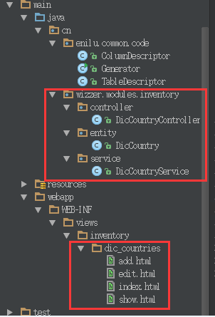

# nutzwk-code-generator

## 特点
- 和nutz其他代码生成器比较，主要具备的特点是代码量少.
- 这么比貌似不厚道，因为其他生成器不仅功能强大，而且还有ui界面。
- 配合IDEA插件：nutzwk-plugin（提供了gui）一起使用会更爽哦，

## 功能介绍
- 自动生成nutzwk的代码，包括model、service、controller和view
- 根据事先建立好的model类，生成对应service，controller和view层代码
- 包括功能：添加，修改，删除，批量删除，分页查询功能。
- 模板引擎使用velocity

## 使用手册

下载地址: https://github.com/enilu/nutzwk-code-generator/releases

```
java -jar nutzwk-code-generator-1.3.jar [-lo]
```

        usage: Main [options] [all|entity|service|controller|view]
         -loader                默认是entity,按pojo生成service和module类, 可以改成table,按数据库信息生成pojo
         -c,--config <arg>      spring datasource config file(classpath)
         -ctr,--package <arg>   controller base package
                                name,default:${package}/controllers
         -f,--force             force generate file even if file exists
         -h,--help              show help message
         -i,--include <arg>     include table pattern
         -mod,--package <arg>   model base package name,default:${package}/models
         -o,--output <arg>      output directory, default is src/main/java
         -p,--package <arg>     base package name,default:cn.wizzer.modules
         -sev,--package <arg>   service base package
                                name,default:${package}/services
         -u,--base-uri <arg>    base uri prefix, default is /
         -v,--views <arg>       for generator pages,default:all pages,eg: -v index_detail  ,will generate index.html and
                                detail.html
         -x,--exclude <arg>     exclude table pattern

手册看花眼了吧，那就去用IDEA搜索插件[nutzwk-plugin](https://github.com/enilu/nutzwk-plugin),酱紫就不用记这些冷冰冰的命令行了

## 用法
### 在自己的项目中添加依赖

```xml
        <dependency>
               <groupId>cn.enilu.tools</groupId>
               <artifactId>nutzwk-code-generator</artifactId>
               <version>1.2</version>
        </dependency>
```        

### 1,根据java实体生成相关代码(推荐使用）
- 准备 java model类：

```java
        @Comment("国家")
        @Table("dic_country")
        public class DicCountry  implements Serializable {
            private static final long serialVersionUID = 1L;
            @Name
            @Prev(els = {@EL("uuid()")})
            private String id;            
            @Column
            @Comment("编码")
            @ColDefine(type = ColType.VARCHAR)
            private String code;            
            @Column
            @Comment("名称")
            @ColDefine(type = ColType.VARCHAR)
            private String name;            
            setter...
            getter...   
        }
```

- 运行Generator类的时候加上如下参数：         
    
        -i DicCountry -p cn.wizzer.modules.back.sys  -u /private/sys


- 会生成目录结构如下的代码：
 
 

 
### 2,根据表生成相关代码（不推荐使用）

- 比如使用下面语句建表：

```sql
        CREATE TABLE `dic_country` (
          `id` varchar(32) NOT NULL,
          `code` varchar(32) DEFAULT NULL COMMENT 'label:值',
          `name` varchar(64) DEFAULT NULL COMMENT 'label:显示值',
          `createAt` int(30) DEFAULT NULL,
          `updateAt` int(30) DEFAULT NULL,
          PRIMARY KEY (`id`)
        ) ENGINE=InnoDB DEFAULT CHARSET=utf8 COMMENT='label:国家号';
```

- 更改db.properties(如果没有请参考本项目中新建）
- 确保项目中有mysql驱动
- 运行Generator类的时候加上如下参数：         
    
        -i dic_country -p cn.wizzer.modules.back.sys  -u /private/sys
        

- 会生成和上图一致的代码
 
 
 **IDEA用户配合[nutzwk-plugin](https://github.com/enilu/nutzwk-plugin)使用会更爽哦**

